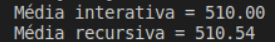
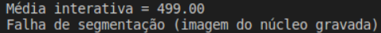
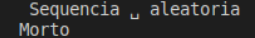
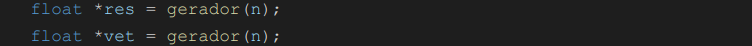
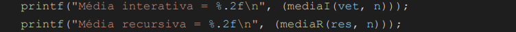
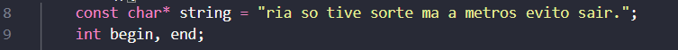
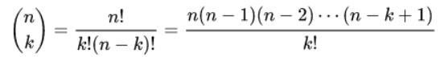
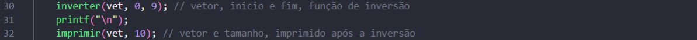

# Roteiro 01

>Na matéria de Laboratório de Algoritmos e Estrutura de Dados II foi desenvolvido e ensinado a como mexer em C++ de forma prática e teórica, dessa maneira, foi liberado questões na qual são de cunho avaliativo. E para a prática e compreensão de mais um conteúdo passado em sala, utilizamos Git e GitHub para apresentar e dispor das explicações e desenvolvimento dos códigos no repositório [desEstruturados](https://github.com/liviabeatrizml/desEstruturados).

Código fonte das questões:
| [q1.cpp](https://github.com/liviabeatrizml/desEstruturados/blob/main/Roteiro_01/q1.cpp) | [q2.cpp](https://github.com/liviabeatrizml/desEstruturados/blob/main/Roteiro_01/q2.cpp) | [q3.cpp](https://github.com/liviabeatrizml/desEstruturados/blob/main/Roteiro_01/q3.cpp) | [q4.cpp](https://github.com/liviabeatrizml/desEstruturados/blob/main/Roteiro_01/q4.cpp) 
|--|--|--|--|

| [q5.cpp](https://github.com/liviabeatrizml/desEstruturados/blob/main/Roteiro_01/q5.cpp) | [q6.cpp](https://github.com/liviabeatrizml/desEstruturados/blob/main/Roteiro_01/q6.cpp) | [q7.cpp](https://github.com/liviabeatrizml/desEstruturados/blob/main/Roteiro_01/q7.cpp) | [q8.cpp](https://github.com/liviabeatrizml/desEstruturados/blob/main/Roteiro_01/q8.cpp) |
|--|--|--|--|

Código fonte dos desafios:
| [qd1.cpp](https://github.com/liviabeatrizml/desEstruturados/blob/main/Roteiro_01/qd1.cpp) | [qd2.cpp](https://github.com/liviabeatrizml/desEstruturados/blob/main/Roteiro_01/qd2.cpp) |
|--|--|

Desenvolvimentos explicativo das questões: 
| [q1.cpp](#Questão-01) | [q2.cpp](#Questão-02) | [q3.cpp](#Questão-03) | [q4.cpp](#Questão-04) | [q5.cpp](#Questão-05)
|--|--|--|--|--|

| [q6.cpp](#Questão-06) | [q7.cpp](#Questão-07) | [q8.cpp](#Questão-08) | [qd1.cpp](#Questão-Desafio-01) | [qd2.cpp](#Questão-Desafio-02)
|--|--|--|--|--|

## :computer: Desenvolvimento e explicação dos códigos: 
## Questão 01
>Questão feita em sala, alterada para compreensão e maior entendimento da mesma.

Temos de inicio a adição da biblioteca <time.h> que irá disponibilizar as funções de tempo como por exemplo o clock() e por fim inicializamos a função de algoritmoDemorado(int n).

### int main()
Na função principal começamos criando as variáveis que irá auxiliar no desenvolvimento do código, coloquei o valor de soma como 0 e a variável "x" que irá fazer a soma como parâmetro da função de algoritmoDemorado tem o valor de 100. 

Após isso criamos um for para fazer a média do tempo, dando o start com a variável t1, em seguida é chamado a função algoritmoDemorado já com o parâmetro sendo x, assim entramos na função.

### int algoritmoDemorado(int n)
A função do algoritmoDemorado nada mais é do que um somatório de quarto variáveis em quatro for, onde terá os iteradores que realizar a soma enquanto essas variáveis forem menor do que "n"(variável x) e por fim irá ser feito uma soma de todas essas variáveis retornando assim o seu resultado.

Voltando para a função main teremos a variável t1 finalizando o tempo de execução do algoritmo e já guardando o seu tempo final, após essa declaração é feita a soma de todos os tempos.
Para apresentar o tempo na qual o algoritmo precisou para executar o código foi feito a seguinte operação ((float)soma)/x)/CLOCKS_PER_SEC), essa função tem como objetivo fazer a media do tempo e colocar em segundos finalizando assim o código.

## Questão 02

 - Alternativa a) 
   - Cálculo iterativo e recursivo da média;

 - Alternativa b) 
   - Testar com as seguintes quantidades de sequências aleatórias: 
      - [x] 10³ ou 10^3
  
    
  
      - [x] 10⁶ ou 10^6 (apenas Média Iterativa)

    
 
      - [ ] 10⁹ ou 10^9

    

- Alternativa c) 
   - Qual a complexidade de cada algoritmo(médiaI e médiaR):

    **Média Iterativa:** Complexidade "O(n)". Seguindo a lógica de quanto maior o tamanho (quantidade de elementos), maior o tempo de execução, assim, será um problema Linear. 
    
    Calculando a complexidade da Média Iterativa:

    

    Então **T(n) = 2n + 5**, assim o elemento mais relevante nessa equação é o N, então a complexidade desse código é de O(n).

    **Média Recursiva:** Complexidade "O(n)". Pois, o tempo de execução de uma função recursiva sempre será dado pela relação de recorrência, ou seja, de acordo com a quantidade de chamadas da recursão.

    Vendo que a chamada *mediaR(res, tam - 1* é a reprodução da recorrência, o custo total dela será igual a soma de cada passo (chamada recursiva). 

    T(n) = T(n − 1) + 1
    
    > *T(n - 1)*, representa as chamadas da recursão;

    > *+1*, representa a verificação do caso base(if);

    

    É possível observar com a resolução da função que o máximo de passos possível será de *n – 1*. Assim, podemos dizer que o cálculo sobre a complexidade será igual a ***(n−1) * 1 + 1***, ou seja, **O(n)** pois o elemento mais relevante será o n.

    > *(n - 1)*, significa o número máximo de casos;

    > **1*, significa a multiplicação final no custo total em todos os casos.

### float *gerador(size_t n)

Função que gera os números aleatórios para o cálculo da média.

### int main()
Na função “main” a variável “n” recebe o tamanho dos elementos a serem calculados na média, ou seja, a quantidade de números a serem somados.

O ponteiro do tipo float “res”, aponta para a função responsável por gerar os “n” valores aleatórios para o cálculo da média usando função recursiva. De maneira análoga, o ponteiro “vet” recebe os valores aleatórios para o cálculo da média iterativa.

O laço “for” fica responsável por contabilizar todos os “n” elementos gerados

Logo após, entra-se na função responsável pelo cálculo das médias iterativas e recursivas propriamente ditas

Ambas as funções “mediaI” e “mediaR” recebem como parâmetros o tamanho (quantidade) de elementos e o ponteiro “res” e “vet”, respectivamente, que aponta para os respectivos valores armazenados.

### float mediaR(float *res, int tam)

Na função recursiva (mediaR), as condicionais informam que se porventura o tamanho for igual a 1, ou seja, caso esteja calculando a média de apenas um número, o retorno será o próprio valor, ocupado pela posição 0 no referente vetor.

Caso contrário, isto é, se a média for feita com mais de um elemento, o retorno da função recursiva será a expressão dada pela questão, que diz respeito ao cálculo da média de todos os valores sobre a quantidade de valores existentes.

## float mediaI(float *vet, int tam)

Já no caso da média iterativa, existirá uma variável “soma” para alocar a soma dos números que se quer obter a média. Enquanto a variável de incremento “i” for menor que o tamanho (quantidade de elementos) a “soma” contabilizará os valores. Por fim, a função retorna o resultado da soma pelo tamanho de elementos, ou seja, a solução da média.

## Questão 03
Antes de tudo, definimos as bibliotecas que iremos usar no código, como _stdio.h_ e _stdlib.h_ que usamos normalmente em tudo código e _string.h_ que nos ajudará a mexer e trabalhar com tipo _char_ e _string_. Além disso, definimos também a função que irá resolver nosso problema em questão.

### int main()
Inicialmente na _main_, definimos as variáveis que iremos usar, uma _const chat*_ que será frase que iremos analisar se é ou não palíndromo e os índices que iremos analisar a cada passo.

Seguindo determinamos os valores iniciais dos índices que passaremos como parâmetro para a função e, pra isso, usamos a função _strlen()_ da biblioteca _string.h_, que descobre o tamanho da _string_ em questão

Por fim, chamamos a função passando como parâmetro as variáveis que temos que analisar e obtemos um resultado em forma de _printf_. Para finalizar o processo fazemos um _return 0_ para encerrar nosso código

### void palindromoVerify()
É uma função do tipo void que irá mostrar se o _string_ em questão é ou não é um palíndromo. Ela recebe como um ponteiro de char (uma _string_), o índice como inteiro do primeiro (_begin_) e ultimo (_end_) elemento da string.
A existência do _const_ antes do ponteiro de _char_, tem finalidade de garantir que o parâmetro ou variável não seja modificado. Além disso, no momento da depuração, o _g++_ emite um aviso sobre essa situação, uma forma de resolver isso é colocando o _const_ no _char_.
Dentro da função, criamos dois _if’s_ para “ignorar” os espaços (_char = 32_), vírgulas (_char = 44_) e pontos finais (_char = 46_) dentro da _string_, com o intuito de analisar somente as letras nela presente.

A seguir definimos os dois casos bases da nossa recursão, sendo um deles onde os elemento em analise são diferentes, o que significa que a frase em questão não é um palíndromo, ou que todos os elementos foram analisaram e se provaram iguais, significando que a frase é um palíndromo

Caso nenhum desses dois casos ocorra, é feita a chamada da função novamente, analisando os próximos caracteres.

## Questão 04
### int main()
Na main temos o corpo da questão, desde a criação das variáveis 
como também as impressões. Além disso, temos um printf que apresenta os números utilizados para calcular a função e a própria chamada da função funcaoBinomial, uma função recursiva.

### int funcaoBinomial()
Antes de iniciar a função, sabe-se que é possível realizar o cálculo de um número Binomial de duas formas, uma delas é através do método padrão, que envolve fatoração e divisão dos termos, e a outra que foi aquela mostrada na questão, sendo ela baseada na regra de Pascal.

Primeiramente, definimos os casos bases que a função deve possuir no intuito de fazer a recursão ter um fim, que seriam:

 - **k > n** retorna 0 (linha 14 e 15), pois de acordos com as regras é impossível calcular o número binomial nessa circunstância;
 - **k == 0 || k == n** retorna 1 (linha 16 e 17), esse seria o principal caso base, pois quando o valor de k for igual a 0, então o binomial dele será 1.
 
 Por fim, temos a própria chamada recursiva, que no fim irá retornar o valor do número binomial corretamente.

 
 

## Questão 05
Em primeira instância o código solicita ao usuário duas informações, sendo elas, uma posição do Fibonacci (int n) e um valor/número (int k) que seja menor/igual a int n. Com isso, foi utilizado a estrutura "do while" para que, enquanto for digitado um valor int k maior que o int n, o programa ficará pedindo ao usuário um valor que seja '<=' que int n.

Após ser informado os dados acima, vai ser calculado quantas vezes o int k se repete dentro de uma função recursiva (int contFib (int n, int k)).

No escopo do código foi adicionada uma variável global que será usada dentro do contador da função.
Quando o valor do int n for igual ao int k, de forma recursiva a função vai comparar as duas variáveis e incrementar +1 para todo caso verdadeiro. 

Dessa forma, ao fazer todo o processamento do código, no final será retornado a quantidade de repetições que o int k terá dentro da função recursiva int n.

## Questão 06
### void imprimir() 
Uma função recursiva do tipo void que recebe como parâmetro um vetor de inteiro e um inteiro (tamanho do vetor). Tal função tem o intuito de imprimir os números presentes no vetor. Inicialmente definimos o caso base da função recursiva, e dentro dele colocamos um printf que irá mostrar o primeiro elemento do vetor.

Caso não cumpra com o caso base logo de início, é chamada novamente a função imprimir(), mas decrementando em 1 o tamanho. Quando o caso base é acessado, as recursões vão sendo resolvidas e com isso, também é feita a impressão a cada realização.

### void inverter()
A função recursiva inverter tem como tipo void e recebe como parâmetro um vetor de inteiro que será invertido, um índice inicial (i) do vetor e o índice final (f) do vetor, que servirão para inverter os elementos a cada passo. 
Antes de iniciar, definimos uma variável auxiliar (aux) que irá nos ajudar a inverter os elementos a cada chamada.

Com a variável criada, criamos um if com a condição presente no if é a de se o índice inicial (i) for menor que índice final (f), onde ela irá determinar se ainda falta inverter algum elemento ou não. Caso a condição for obedecida:
 - A variável aux recebe o valor do elemento i; 
 - O valor do elemento i irá receber o valor do elemento f; 
 - O valor do elemento f irá receber o valor de aux;

Por fim é chamada novamente a função inverter(), mas incrementando em 1 o índice i e decrementando o índice f em -1.

Caso a condição não seja seguida, a função é encerrada, o que significa que o vetor está invertido ou não é possível

### int main()
Na main, primeiro definimos o vetor de números que iremos inverter com a nossa função criada e imprimimos com a função imprimir() ela para conferir como esta, e após comparar com a invertida.

Após isso, chamamos a função inverter() para realizar o processo de inversão do vetor e imprimimos logo adiando para compararmos com o vetor anteriormente criado.

 
## Questão 07
### int main()
Nessa função é atribuído um valor a variável “n” e impresso na tela a chamada da função que calcula a raiz quadrada aproximada do número determinado anteriormente.

 
### float raizQuadrada(float num, float raiz, float margem)
Na função “raizQuadrada” é atribuído três parâmetros responsáveis por reservarem o número no qual se quer extrair a raiz quadrada (num), o resultado da raiz (raiz) e a margem de erro admissível (margem). A variável “x” aloca o resultado da multiplicação da “raiz” pela diferença entre o número requerido em “n”. Por exemplo: usando o número 144 para descobrir sua raiz quadrada. Será atribuído o valor -131 a “x”, uma vez que (3.5 * 3.5 - 144) = -131. Caso o valor de “x” for menor que zero, como no exemplo, será atribuído -1 a “x”. Caso contrário, “x” = 1.

 
Se o valor da “raiz” elevado ao quadrado, subtraído do número que se quer extrair a raiz quadrada, multiplicado por “x” (diferença da multiplicação entre raízes do número a ser descoberto), for menor que a margem de erro, será retornado o valor aproximado da raiz quadrada: ((raiz * raiz) - num) * (x)) <= margem) Essa condição gera o valor final da raiz após a chamada recursiva da função “raizQuadrada”. Nesse sentido, a variável “margem” é a referência para o fim da função, uma vez que assume um valor mínimo como erro admissível para resultados de raízes não exatas.
O retorno da “raizQuadrada” será dado pela expressão exposta na questão, que diz respeito à função de extrair a raiz quadrada de um determinado número. Tal expressão é dada pela multiplicação entre aproximação de raízes somado ao número que se quer retirar a raiz quadrada sobre duas vezes o valor da aproximação. Esse último retorno ocorrerá recursivas vezes enquanto não for descoberto o valor da raiz.

## Questão 08
> **:warning:** Questão depurada em vídeo com acesso apenas para o professor via drive **:warning:**
### int fatorialComCauda
> Fatorial com cauda

https://drive.google.com/file/d/1ByhdRJHscOE91TEwR7OwUqI05BAHZozS/view?usp=sharing

**:warning:** Acesso liberado apenas para o professor

### int fatorialSemCauda( )
> Fatorial sem cauda

https://drive.google.com/file/d/1f-kCXT_mLOh6HtwEBMbgRdhZ6UT-FM55/view?usp=sharing

**:warning:** Acesso liberado apenas para o professor

## Questão Desafio 01
>Antes de tudo definimos as bibliotecas (includes) que iremos utilizar para realizar o problema e declaramos as funções que compõem nosso código.

 
### int alocaMatriz( )
Função do tipo inteiro e que retorna um ponteiro de ponteiro, ela recebe como parâmetro o tamanho da matriz através do número de linha e colunas passadas pelo usuário.
Logo de inicio definimos um ponteiro de ponteiro (_mat_), para podermos alocar dinamicamente (por meio do _malloc_) a memória suficiente para guarda os valores (ponteiros (_mat[0]_ na imagem), que apontam para onde estarão os valores) em cada posição, semelhante a um vetor de ponteiros de linhas contíguas.

 
Em seguida, criamos um for para definir todas as linhas em cada coluna. E por fim fazermos o return da matriz alocada, a mat.

 
### void mostraMatriz( )
Função do tipo void que recebe como parâmetro a matriz (_** mat_) e o tamanho da matriz (_linha_ e _coluna_, são inteiros).
A função consiste somente em um 2 for’s encadeado e delimitado pelo número de linhas e colunas, tendo como intuito, o de imprimir todos os elementos presente na matriz.

Mas, caso o número de lin e col for igual a i e j, respectivamente, sendo lin e col definidas pelo usuário e passada para função, marca um X ao invés do seu elemento, mostrando em que lugar que o indicador (quadrado colorido) está.

### void limpaMatriz()
Função do tipo void que recebe como parâmetro a matriz (mat, um ponteiro de ponteiro) e número de linhas (int) que serve para auxiliar até onde se deve limpar.
Ela é composta somente por um _for_ que irá percorrer todos os ponteiros presentes na _mat_ e limpa-los (_free_), limpando assim tudo o que tinha dentro deles. Por fim, é limpado todos os ponteiros presentem na _mat_.

### int calculaArea()
Função recursiva do tipo inteiro que recebe como parâmetro um matriz _(**mat_), o ponto (_linInciale_  _colIncial_) inicial definidas pelo usuário e a localização do quadrado (_linhaAtual_ e _colunaAtual_).
Antes de iniciar, para a construção do código, consideramos que o usuário sempre irá definir os pontos iniciais como umas das 4 extremidades.

Inicialmente definimos se o decréscimo ou acréscimo na _linhaAtual_ ou na _colunaAtual_ for menor que 0 ou maior que 5 como caso base da recursão e assim encerrado a recursão

Após isso, utilizamos alguns _if’s_ para localizamos o ponto inicial, sendo ele uma das extremidades determinadas pelo usuário e determinar a ordem de contagem dos quadrados em cada ponto

Dentro de cada _if_, verifica-se duas situações: se o elemento _mat[linhaAtual][colunaAtual]_ for igual 1 ou igual a 0.

Igual a **1**: Significa que o elemento não deve ser contabilizado e que todos os elementos da linha já foram, então é feita um acréscimo de 1 no valor da _linhaAtual_ e retornado a _colunaIncial_ no lugar da _colunaAtual_;

Igual a **0**: Significa que está posição deve ser considerado e somado com o total até o momento, além disso, é feita a impressão da matriz mostrando a posição atual. Após isso, é feita um acréscimo de 1 no valor da coluna

Difere somente o acréscimo ou decréscimo relacionado com ordem da soma da área.

### int main()
Nela, declaramos primeiro as variáveis que iremos utilizar para auxiliar na chamada das funções.

Depois, com auxílio do printf, pedimos ao usuário para definir o tamanho da matriz (L x C) que iremos utilizar para contar os quadrados brancos. 

Seguindo, alocamos a matriz através da função _alocaMatriz()_.

Por meio de dois _for’s_ encadeado, é determinado como 0 (quadrado branco) todos os pontos da matriz, mas em alguns pontos tais valores devem ser 1 (quadrado preto).

Com os valores da matriz já definidos, pedimos ao usuário para definir os pontos iniciais para assim poder calcular os quadrados brancos divididos pelo preto. Para fins de melhor visualização, chamamos a função _mostraMatriz()_;

Agora definimos que a variável _área_ irá receber o valor retornado da função _calculaArea_. E finalmente, mostramos o valor de quadrados brancos (0) presentes no QUADRADO (matriz) por meio de um _printf_.

O ultimo passo presente na main é a limpeza dos dados da matriz, ou seja esvaziar e limpar a memória alocada para a mesmo por meio da função _limpaMatriz()_;

## Questão Desafio 02
>Antes de iniciar, foi definido todas as bibliotecas (includes) que iremos utilizar no código, definimos duas variáveis que nunca iram mudar seu valor (_numLin_ e _nunCol_) e declaramos as funções que compõem nosso código.

### void movimentar()
Função recursiva do tipo _void_ que recebe como parâmetro a matriz (_** mat_), a linha e coluna atual que detalha o ponto em que está a cada movimento (_linAtual_ e _colAtual_) e o ponto de destino (_linDestino_ e _colDestino_).

Inicialmente definimos o base da nossa recursão, sendo ele quando o ponto inicial (_linAtual_ e _colAtual_) for igual o ponto de chegada (_linDestino_ e _colDestino_). Dentro desse caso base, imprimimos a matriz com a função _mostrarMatriz_ e mostramos que ele chegou ao seu destino.

Após o caso base, verificamos se o valor da posição atual é igual a 1, se for, significa que atingiu uma parede, então ele (o ponto X) tem que andar para baixo através de _return_, ou seja, para a próxima linha.

Se esse caso anterior não acontecer, significa que o ponto pode continuar andando para frente (uma coluna adiante). Vale ressaltar que a cada passo que o ponto X dá é imprimido a matriz mostrando o X no seu lugar através da função _mostrarMatriz()_.

### int main()
Na main, antes de iniciar o código, definimos todas variáveis que serão usadas durante o código e alocamos a matriz dinamicamente (_mat_) com o uso da função _alocaMatriz()_.

Com a matriz alocada, definimos os valores de cada posição na matriz, com o intuito de criar um “terreno” por onde X irá se mover até o ponto final, quando _mat[i][j] = 1_ significa que ali é uma parede e quando igual a 0, significa que é um caminho livre para o ponto X se movimentar.

Com a matriz criada com seus devidos valores, pedimos ao usuário para dá os valores do ponto de saída do X (_linInicio_ e _colInicio_) e de chegada Y (_linChegada_ e _colChegada_) que servirão como parâmetro da função _movimentar()_ o ponto X.

O último passo é chamar a função _movimentar()_ que guiará o ponto X até o ponto Y por meio de recursão. No final, após chegar ao ponto de destino é feito o esvaziamento da matriz por meio da função _limpaMatriz();_

